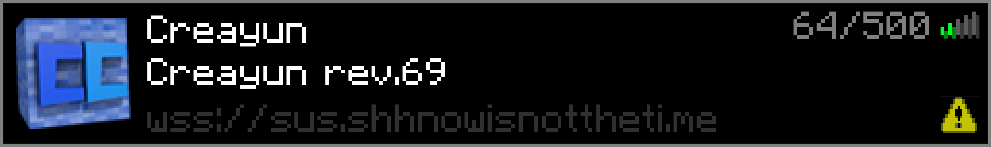
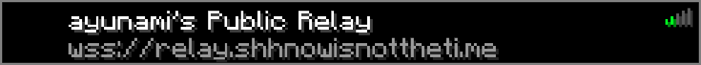

# EaglercraftXPreview
### Server & Relay Widget for EaglercraftX (original code by [ayunami2000](https://github.com/ayunami2000))




## Features
- **Full support for EaglercraftX Servers and Network Relays**
- **Animated MOTDs are supported**
- **Proper debugging and logging built in, and runs smoothly in browsers**
- **Written purely in javascript, with no extra frameworks or nonsense**
- **Lightweight and fast (~15KB)**

## Downloads
You can download a complete ready to go ZIP file containing the compiled `assets.bin` and a HTML file showing a example of it working from the [Releases](https://github.com/fergusfergusfergus/eaglerxpreview/releases) tab.

However, if you want compile this for yourself, firstly get your widget.js and get your sprites.png, then make a new file and make the contents of the file: (contents from widget.js)+(4 null bytes `00 00 00 00`)+(contents from sprites.png), then finally compress that file with the `deflate-raw` algorithm, The final, compressed file is your `assets.bin`.

## Configuration
```javascript
window.eaglercraftXPreview = {
	widget: document.getElementById("example"),
	name: "Minecraft Server", // the name of your server, this will be displayed on your widget.
	force: false, // whether to prioritise the server name over the query name.
	addr: "wss://example.com", // the websocket address of your server
	hideAddr: false, // whether to hide the address of the server on the widget
	spritesheet: "example.png", // the link to your spritesheet used for showing icons on the widget
	type: "server" // "server", "relay"
};
```

## Compatibility
| Browser   | Supported Version |
|-----------|:----------------:|
| Chromium  | 105+             |
| Firefox   | 115+             |
| Safari    | 16+              |
